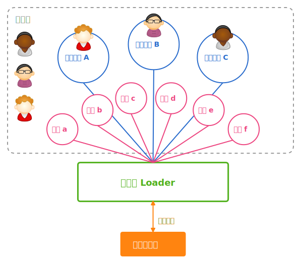
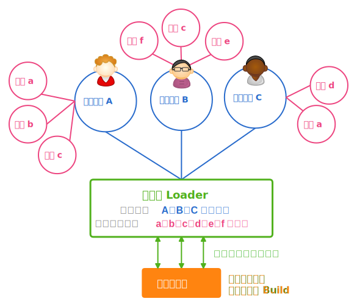

# 前端模块加载策略
## 前端模块的理想实践

过去开发 JavaScript 并没有一个好的模块架构去管理依赖关系与加载机制，当项目变复杂，往往难以维护。直到 nodeJS 采用 CommonJS 1.0 的模块规范造成流行后，大家开始热烈讨论浏览器端的模块架构的规范与实作，现在 AMD 规范与 RequireJS 实作可说是整个前端业界的当红炸子鸡，提供前端程序员有个标准开发 JavaScript 模块并清楚定义依赖关系及轻松加载。

但对于一个网站的前端开发来说，我们要考量的并不只是动态加载的 JavaScript 档案、还得考量 CSS 如何载入。甚至当我们采用了如雅虎把页面切割更细的「页面模块开发模式」后，又该怎么做呢？

## 模块定义

模块的定义有千百种，大多是指可以重复利用的元件，让开发者可以直接采用、避免重新打造轮子。我们这边所指的模块则是任何可以被载入的 HTML、CSS、JavaScript 档案。例如 jQuery 在载入后可以简便许多 JavaScript 的操作、而 Twitter Bootstrap 则让不善美工的程序员轻松拥有亮丽的版面。两个模块一挂入网页，真可说是神兵利器，可以满足前端程序员许多的需求。

## 页面模块开发模式

前面提到雅虎的「页面模块开发模式」，则是把页面依结构切分成一个个小的 &lt;div/&gt; 模块，原则上每一个页面模块都各有自己的 HTML (例如 PHP 是用 include_once 来载入)、CSS 与 JavaScript 档案。好处是让每个开发人员都能专注于单一模块的开发上、而非去烦恼整个页面的架构与布局。重复利用在这样的开发模式下并不是最重要的事情。


* 图 1 - 范例网页：两岸三地的开发者


* 图 2 - 两岸三地的开发者网页的页面模块结构图

以上的頁面共有三个页面模块：上面的「条件筛选模块」(\_filter)、左边的「资讯模块」(\_info)、右侧的「列表模块」(\_list)，都各自有自己的 HTML、CSS、与 JavaScript。

这样的模式是目前业界的开发主流，后面将以这个开发模式为思路基础。

## 一、傳統加載模式

传统加载模式就是使用 &lt;link/&gt; 载入 CSS、&lt;script/&gt; 载入 JavaScript。当我们要去证明可行性、实作一些小工具，不论老手新手，用这样的方法准没错。但是很可惜的他并不适用于团队的开发上。例如一个页面上有三个页面模块，那么就至少会有 3 (个模块) * 2 (个类型：CSS/JS) = 6 个请求的产生，加上一些函式库，超过 10 个是轻而易举的，如下图：

```html
<link href="bootstrap.min.css" rel="stylesheet">
<link href="base.css" rel="stylesheet">
<link href="_filter.css" rel="stylesheet">
<link href="_list.css" rel="stylesheet">
<link href="_info.css" rel="stylesheet">
<script src="jquery.js"></script>
<script src="_filter.js"></script>
<script src="_list.js"></script>
<script src="_info.js"></script>
<script src="base.js"></script>
```

传统加载模式的問題為：

* 请求数量過多：适当的数量有助于并行下载、但过多则会造成效能问题。通常我们会鼓励一个网页的 JavaScript 与 CSS 的请求总数量维持在 5 个左右。
* 阻塞页面显示：若 JavaScript 或 CSS 档案所在服务器回应较慢，将会使得在后面的 HTML 被延迟显示，对使用者浏览体验是很不好的。
* 内容未压缩：较专业的程式码在上线后需要压缩以加快下载速度。
* 在不同页面需顧慮前后顺序等問題：当页面多的时候，我们可能得用后端的 switch 来决定载入哪些模块，这时常会有依赖关系造成前后顺序很难易处理。

任何稍具规模网站采用这样的开发模式都不能视为专业。

## 二、頁層級設定加載模式

页层级设定加载模式是指：「依不同的页面设定所需的 JavaScript 与 CSS 模块」。例如上面页面（称为 Page A）设定要载入 \_filter.js, \_list.js, \_info.js, \_filter.css, \_list.css, \_info.css 等 6 个模块案，而 B 页需载入 \_photo.css, \_photo.js 等 2 个模块案。所有的依赖模块都要开发的程序员在页层级的设定档案指定载入。

### 透過工具合併及最小化檔案

而模块开发的主要问题在于它产生许多小的模块档案，得有一个工具/机制将这些零散且小的档案合并及最小化。这边以 Mini (http://github.com/josephj/mini) 工具为例子，它有一个中央设定挡：

```xml
<!-- A 页面 -->
<module id="page_a">
    <!-- 依赖模块档案 -->
    <file type="css" src="bootstrap.css">
    <file type="css" src="base.css">
    <file type="js" src="jquery.js">
    <file type="js" src="module.js">
    <file type="js" src="base.js">
    <!-- 页面模块档案 -->
    <file type="css" src="_filter.css">
    <file type="css" src="_list.css">
    <file type="css" src="_info.css">
    <file type="js" src="_filter.js">
    <file type="js" src="_list.js">
    <file type="js" src="_info.js">
</module>
<!-- B 页面 -->
<module id="page_b">
    <!-- 依赖模块档案 -->
    <file type="css" src="bootstrap.css">
    <file type="js" src="jquery.js">
    <file type="js" src="module.js">
    <!-- 页面模块档案 -->
    <file type="css" src="_photo.css">
    <file type="js" src="_photo.js">
</module>
```

你只要在浏览器的网址列输入以下的网址：

``` 
http://localhost/mini?module=page_a&type=js 
```
就可以得到 page_a 合并与最小化混淆过后的 JavaScript 档案。这样一下子就解决了傳統加在模式中请求数量与内容未压缩的问题。

### 页层级设定的整体架构



* 图 3 - 页层级设定的架构示意图

虽然每位程序员专注于开发自己的模块、但都得共同修改同一个设定档，此设定档记载了每页要载入的模块有哪些。是一个很直觉的作法。

### 页层级设定的缺点

* 维护不易：当要移除一个页面模块时，当然要把依赖的模块也一并移除。但很不幸的，实际的页面可能有 10 个以上的依赖模块，作为一个页面模块程序员，你并不能百分之百确认别的页面模块开发者会不会用到你所移除的依赖模块，常常会让模块越积越多。
* 发布耗时过久：这种页层级通常得在发布前预先做好合并及压缩，当页面一多，整体的时间就会很久。根据持续集成的概念，网站 Build 的时间不应该超过 10 分钟，这一步通常会影响到这个目标。
* 线上调势困难：因为发布出去的都是混淆过后的代码，是几乎没办法做调势的。

页层级设定最大的问题就是维护不易，主要是没有一个地方定义模块的依赖关系。此外我们都已经用页面模块作为开发单位，理应专注于模块的开发、不用管整个页面的复杂性，为何还有一个整个页面的设定档呢？就模块化开发页层级设定的思路是很不好的！

## 三、模块层级设定加载模式

此模式可以让我们再往真正的模块化开发更前进一步！

### 模块层级设定的整体架构



* 图 4 - 模块层级设定的架构示意图

1. 程序员在此模式开始要定义自身页面模块的依赖关系，下图的三个程序员各自开发不同的页面模块，而依赖的模块重复或不重复的都有。
2. 页面的 Controller 会指定要载入的页面模块有哪些，但不需提供依赖的那些模块，会由加载的 Loader 自动计算，得到所有应该要载入的模块。
3. Loader 会与服务器端交互，透过一个聪明的机制（后面解释）将模块分组并做合并与压缩，再用并行下载的方式将分组的请求给下载到浏览器上。

### 定义模块的依赖关系

前面开头我们就提到 AMD 的模块规范，其中很重要的设定便是在定义每个模块的依赖关系，例如：

````js
// AMD Module
define("editor", ["a", "b", "c"], function () {
    function Editor {
        /* Constructor */
    }
    return Editor;
});
require(["editor"], function (Editor) {
    new Editor();
});
````

* define 定义了 editor 模块要载入 a.js, b.js, c.js 等三个模块。
* require 是在用的时候只要指定 editor，并不需要指定相依模块。

RequireJS 是目前最多人用的 AMD 架构实作。

### 让 Loader 载入相依的模块档案

以 RequireJS 来说，只要有定义好依赖关系，它就会一个一个地将相依的模块自动载入，并不需要任何的配置。而当想要发布到线上时当然得合并与最小化，你可以用 nodeJS、透过它所提供的 r.js 把你把这件事给解决掉。

但是我们在页面层级设定提到过预先 Build 与最小化将会造成「发布时间过久」与「线上调适困难」等两个问题，甚至在开发阶段若请求过多也将是个困扰，这都是 RequireJS 没办法解决的。我们必须找一个另外的解决方案！

### YUI3 - 更好的模块加载方式

YUI3 模块依赖关系设定与 AMD 如出一辙：

```js
// YUI Module
YUI.add("editor", function () {
    function Editor {
        /* Constructor */
    }
    Y.Editor = Editor;
}, "VERSION", {requires:["a", "b", "c"]});
YUI.use("editor", function (Y) {
    new Y.Editor();
});
```

但它的 Loader 的下载方式非常令人激赏，它会利用一种叫 Combo Handler 的机制，将线上的档案直接以 GET 的方式指定路径、动态地合并并且最小化：

```
http://yui.yahooapis.com/combo?
                         <模块 1 的对应路径>&
                         <模块 2 的对应路径>&
                         <模块 3 的对应路径>&
                          ...
                         <模块 n 的对应路径>
```                    

你可能会想到 GET 的长度限制，但聪明的 YUI Loader 早就考虑好了，它检查了「模块载入的先受顺序」、「模块总数量」、「目前浏览器的 GET 长度限制」、「浏览器同时检查数量」等资讯，自动将向 Combo Handler 的情求分散为数个，并且并行下载。


### 动手解决问题！

YUI 非常贴近我们的需求，但还是有一些问题存在：

* 雅虎的 Combo Handler 是否有开源或替代方案呢？
* YUI 的组态设定非常地复杂、不易维护：记载模块依赖关系的设定，但是密密麻麻地，维护相当不易。
* CSS 不适合做动态加载：在大多数的情况中，我们会将 CSS 以 &lt;link/&gt; 放在网页的最前面，让使用者在 HTML 一载入就可以看到正确的 UI，当然还有一些效能考量。但不管 YUI 与 RequireJS 都是走动态加载的作法。

第一个问题很容易解决，网路上类似 Combo Handler 的机制还真的不少，像 PHP5 的 Minify、nodeJS 的   combohandler 都是这样的产品，稍微设定一下，很容易就可以跑起来了。

后面两个问题则需要写程式解决，我的解法是做一个 PHP 叫 StaticLoader 的 Class (https://github.com/josephj/static-loader)。使用时它会去读取模块的设定档：一边产出 YUI 那个复杂的组态档、一边针对 CSS 做特别处理、最后用 link 生成在页面上。

#### 模块的设定档

所有的模块都集中在一个设定档、以下面的方式指定

```php
    "_filter" => array(
        "group" => "demo",
        "js"    => "javascripts/_filter.js",
        "css"   => "stylesheets/_filter.css",
        "requires" => array(
            "module", "node-base", "cookie",
        ),  
    ),  
```

你看到了 JavaScript 与 CSS 的路径、并且也指定了其依赖的关系。

#### 指定所要用的页面模块并且输出

在 Controller 中，只要指定这个页面有哪些页面模块：

```php
require_once "StaticLoader.php";
$loader = new StaticLoader("config.php");
$loader->set("_filter", "_list", "_info");
echo $loader->load();
```

即可输出对应的 link、script 标签与模块依赖关系的设定。


* 图 5 - 使用 StaticLoader Class 输出复杂的 &lt;link/&gt; 与 &lt;script/&gt; 标签与 YUI 模块的设定。

之后就如我们所预期的，它将会去把所有此页面依赖模块的 JavaScript 与 CSS 档案，以 Combo Handler 的方式、从服务器上下载回来。

### 模块层级载入有什么好处

* Build 更有效率：在发布到线上这一步我们不再处理 CSS 与 JavaScript 档案的合并与压缩，就直接将档案复制一份丢到服务器上，由 Combo Handler 本身就有的机制来做合并、压缩、缓存。
* 可以直接线上做调势：原始档案皆存在，可以直接修正问题，只要把 Minify 对应的缓存砍掉即可。
* 维护性提升：開發者只定义自身模块的相依性、整页所需模塊由 YUI Loader 計算後自動載入，管理容易许多。也才是真正的「模块化开发」！

## 结语

页层级的设置可想成「中央集权」，设置容易。初期一目了然，但规模变大就管理不易。模块层级設定则是「地方自治」设置较复杂、对长期维护较有效率。配合相依性计算、自动合并、非同步下载等机制、让页面模块真的做到随插即用。

BigPipe 是很多网站想实作的目标，但首先你得「建立模块相依性」、「采用页面模块开发模式」、先建立模块导向开发模式才可能有实作的机会，鼓励较具规模的网站开始往这方向移动。

* 线上完整范例：http://josephj.com/lab/2012/github-chinese-developer/
* 完整原始码：https://github.com/josephj/github-chinese-developer

