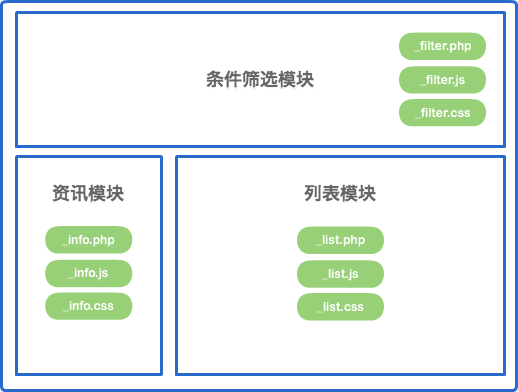
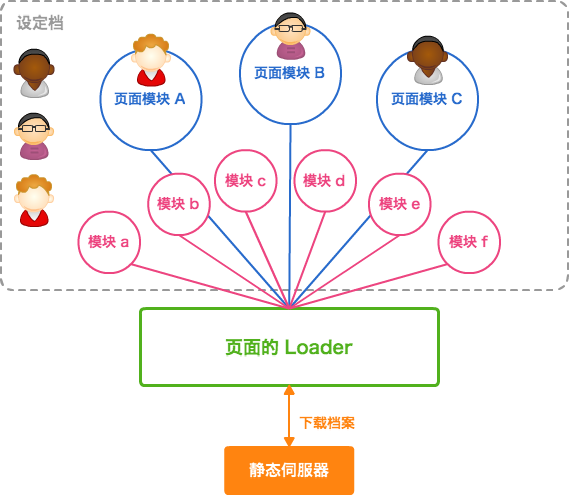
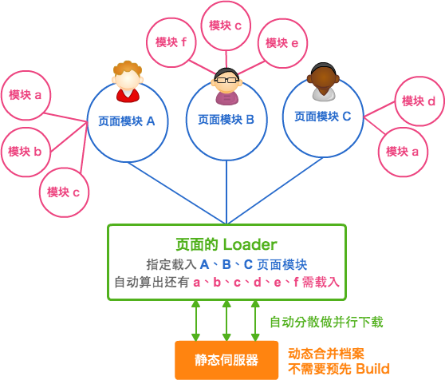

* 关键点、連老手都会感兴趣、让新手可以上路
* 杂志不超过 5 页、
* 原创文章： 150 元、千字

# 前端模块加载策略
## 前端模块的理想实践

过去开发 JavaScript 并没有一个好的模块架构去管理依赖关系与加载机制，当项目变复杂，往往难以维护。直到 nodeJS 采用 CommonJS 1.0 的模块规范造成流行后，大家开始热烈讨论浏览器端的模块架构的规范与实作，现在 AMD 规范与 RequireJS 实作可说是整个前端业界的当红炸子鸡，提供前端程序员有个标准开发 JavaScript 模块并清楚定义依赖关系及轻松加载。

但对于一个网站的前端开发来说，我们要考量的并不只是动态加载的 JavaScript 档案、还得考量 CSS 如何载入。甚至当我们采用了如雅虎把页面切割更细的「页面模块开发模式」后，又该怎么做呢？

## 模块定义

模块的定义有千百种，大多是指可以重复利用的元件，让开发者可以直接采用、避免重新打造轮子。我们这边所指的模块则是任何可以被载入的 HTML、CSS、JavaScript 档案。例如 jQuery 在载入后可以简便许多 JavaScript 的操作、而 Twitter Bootstrap 则让不善美工的程序员轻松拥有亮丽的版面。两个模块一挂入网页，真可说是神兵利器，可以满足前端程序员许多的需求。

## 页面模块开发模式

前面提到雅虎的「页面模块开发模式」，则是把页面依结构切分成一个个小的 &lt;div/&gt; 模块，原则上每一个页面模块都各有自己的 HTML (例如 PHP 是用 include_once 来载入)、CSS 与 JavaScript 档案。好处是让每个开发人员都能专注于单一模块的开发上、而非去烦恼整个页面的架构与布局。重复利用在这样的开发模式下并不是最重要的事情。




以上的頁面共有三个页面模块：上面的「条件筛选模块」(\_filter)、左边的「资讯模块」(\_info)、右侧的「列表模块」(\_list)，都各自有自己的 HTML、CSS、与 JavaScript。

这样的模式是目前业界的开发主流，后面将以这个开发模式为思路基础。

## 一、傳統加載模式

传统加载模式就是使用 &lt;link/&gt; 载入 CSS、&lt;script/&gt; 载入 JavaScript。当我们要去证明可行性、实作一些小工具，不论老手新手，用这样的方法准没错。但是很可惜的他并不适用于团队的开发上。例如一个页面上有三个页面模块，那么就至少会有 3 (个模块) * 2 (个类型：CSS/JS) = 6 个请求的产生，加上一些函式库，超过 10 个是轻而易举的，如下图：

```html
<link href="bootstrap.min.css" rel="stylesheet">
<link href="base.css" rel="stylesheet">
<link href="_filter.css" rel="stylesheet">
<link href="_list.css" rel="stylesheet">
<link href="_info.css" rel="stylesheet">
<script src="jquery.js"></script>
<script src="_filter.js"></script>
<script src="_list.js"></script>
<script src="_info.js"></script>
<script src="base.js"></script>
</head>
<body>
```

传统加载模式的問題為：

* 请求数量過多：适当的数量有助于并行下载、但过多则会造成效能问题。通常我们会鼓励一个网页的 JavaScript 与 CSS 的请求总数量维持在 5 个左右。
* 阻塞页面显示：若 JavaScript 或 CSS 档案所在服务器回应较慢，将会使得在后面的 HTML 被延迟显示，对使用者浏览体验是很不好的。
* 内容未压缩：较专业的程式码在上线后需要压缩以加快下载速度。
* 在不同页面需顧慮前后顺序等問題：当页面多的时候，我们可能得用后端的 switch 来决定载入哪些模块，这时常会有依赖关系造成前后顺序很难易处理。

任何稍具规模网站采用这样的开发模式都不能视为专业。

## 二、頁層級設定加載模式

页层级设定加载模式是指：「依不同的页面设定所需的 JavaScript 与 CSS 模块」。例如上面页面（称为 Page A）设定要载入 \_filter.js, \_list.js, \_info.js, \_filter.css, \_list.css, \_info.css 等 6 个模块案，而 B 页需载入 \_photo.css, \_photo.js 等 2 个模块案。所有的依赖模块都要开发的程序员在页层级的设定档案指定载入。

### 透過工具合併及最小化檔案

而模块开发的主要问题在于它产生许多小的模块档案，得有一个工具/机制将这些零散且小的档案合并及最小化。这边以 Mini (http://github.com/josephj/mini) 工具为例子，它有一个中央设定挡：

```xml
<!-- A 页面 -->
<module id="page_a">
    <!-- 依赖模块档案 -->
    <file type="css" src="bootstrap.css">
    <file type="css" src="base.css">
    <file type="js" src="jquery.js">
    <file type="js" src="module.js">
    <file type="js" src="base.js">
    <!-- 页面模块档案 -->
    <file type="css" src="_filter.css">
    <file type="css" src="_list.css">
    <file type="css" src="_info.css">
    <file type="js" src="_filter.js">
    <file type="js" src="_list.js">
    <file type="js" src="_info.js">
</module>
<!-- B 页面 -->
<module id="page_b">
    <!-- 依赖模块档案 -->
    <file type="css" src="bootstrap.css">
    <file type="js" src="jquery.js">
    <file type="js" src="module.js">
    <!-- 页面模块档案 -->
    <file type="css" src="_photo.css">
    <file type="js" src="_photo.js">
</module>
```

你只要用 /mini?module=page_a&type=js 就可以得到 page_a 合并与最小化混淆过后的 JavaScript 档案。这样一下子就解决了傳統加在模式中请求数量与内容未压缩的问题。

### 页层级设定的整体架构



虽然每位程序员专注于开发自己的模块、但都得共同修改同一个设定档，此设定档记载了每页要载入的模块有哪些。是一个很直觉的作法。

### 页层级设定的缺点

* 维护不易：当要移除一个页面模块时，当然要把依赖的模块也一并移除。但很不幸的，实际的页面可能有 10 个以上的依赖模块，作为一个页面模块程序员，你并不能百分之百确认别的页面模块开发者会不会用到你所移除的依赖模块，常常会让模块越积越多。
* 发布耗时过久：这种页层级通常得在发布前预先做好合并及压缩，当页面一多，整体的时间就会很久。根据持续集成的概念，网站 Build 的时间不应该超过 10 分钟，这一步通常会影响到这个目标。
* 线上调势困难：因为发布出去的都是混淆过后的代码，是几乎没办法做调势的。

页层级设定最大的问题就是维护不易，主要是没有一个地方定义模块的依赖关系。此外我们都已经用页面模块作为开发单位，理应专注于模块的开发、不用管整个页面的复杂性，为何还有一个整个页面的设定档呢？就模块化开发页层级设定的思路是很不好的！

## 三、模块层级设定加载模式

此模式可以让我们再往真正的模块化开发更前进一步！

### 模块层级设定的整体架构

程序员在此模式开始要定义自身页面模块的依赖关系，下图的三个程序员各自开发不同的页面模块，而依赖的模块重复或不重复的都有。



RequireJS
YUI 介绍（以 DataTable 为例）
如何实作：YUI Combo、


我将著重于网站的浏览器端、以自身过去在台湾 Yahoo! 知识+ 及 miiiCasa 的实作经验介绍数种 JavaScript / CSS 模块的切分及加载模式。
内容将从传统 script 与 link 加载、透过页的组态设定加载（以 RequireJS 为范例）、以模块为单位加载（以 YUI 3 为范例）、
同步加载（以 Big Pipe 为范例）分析各种架构的优点与缺点，期待能让厅者能够轻松应用在自己网站的开发上面为目标。

